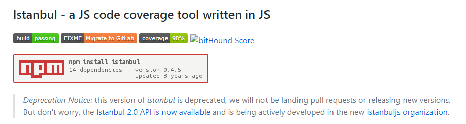
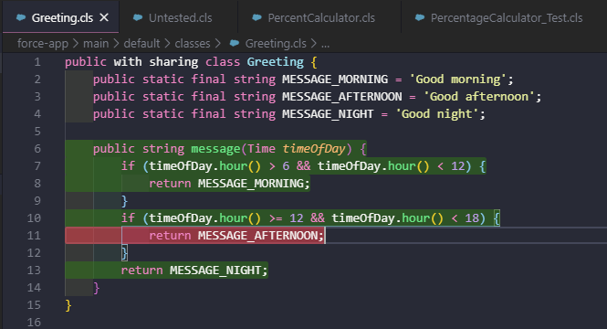

Apex Unit Test Code Coverage Reports
==============

The repository contains a Salesforce CLI plugin that can generate a code coverage report based on Apex test coverage.

## Pre-requisites for use

- Long Term Support [Node](https://nodejs.org/en/download/) 11 or later
- [Salesforce CLI](https://www.npmjs.com/package/sfdx-cli)
- Salesforce Org with apex classes and test coverage

## Installation

### From the master branch
The easiest way to install the plugin is to reference the master branch of this repository; install with the following command

`sfdx plugins:install git+https://github.com/chrisgit/sfdx-plugins_apex_coverage_report.git`

### From source
Clone or download the repository, open a command window in the root of this project and type

`sfdx plugins:link .`

### Verify the installation
`sfdx plugins`

NB: 
This plugin does not have a digital certificate associated with it so to install with `sfdx plugins:install` you may need to create an [SFDX whitelist](https://developer.salesforce.com/blogs/2017/10/salesforce-dx-cli-plugin-update.html).

## Uninstalling
Should sfdx become unstable or the plugin in not suitable for your needs you can easily uninstall it with the following command

`sfdx plugins:uninstall sfdx-plugins_apex_coverage_report`

## Usage
- Run Apex unit tests (with code coverage)
- Run the SFDX plugin against the Salesforce Org and specify the report type
- - example: `sfdx chrisgit:apex:test:cover -f text -u code-coverage`

NB: If --json is specified then the coverage statistics are returned

For quick start you can use the example code in this repository, see [README.md](apex-code-coverage-example/README.md)

## Background

This project came about at work during a firebreak around Christmas 2018 after having used Salesforce and DX for around 3 months. I wrote my first Salesforce CLI to open a Salesforce Org in browser other than the default browser over the course of a couple of hours one morning. One of the tech leads then laid down a challenge to write a Salesforce CLI plugin that could produce an Apex code coverage report that can be included as part of CI.

Creating code coverage output is relatively hard if you do not understand the format, there isn't a great deal of documentation and each format appears to be wildly different! Somewhere along the way I did find a DTD for the Cobertura format!

Rather than having to code something specifically for a specific coverage tool I wondered if I could use an existing product or library ...

... having generated coverage with Node and Mocha I looked at the possibility of using [Istanbul](https://github.com/gotwarlost/istanbul). This appeared to be a really good avenue of investigation, Instabul provides an easy to use [API](https://github.com/gotwarlost/istanbul/issues/17) and clearly documents the [coverage format](https://github.com/gotwarlost/istanbul/blob/master/coverage.json.md). To be fair Istanbul does all the heavy lifting in this plugin, leaving me with the simple job of assembling all of the components provided by Salesforce and Istanbul.

There are a couple of things to note:
- Currently only reports on classes (not triggers)
- Will only report on classes that have SOME coverage; if there is no coverage record the class will not be reported on

One final thing, this was designed with  SFDX style projects in mind where the class files reside locally, if the files do not reside locally they are downloaded and stored in a folder named `apex\classes`. Any files with duplicate filenames will not be reported on correctly.


Also to be clear
- The code here is *NOT* representative of the version created during the firebreak and no further work is planned for this version, hence publishing on my repository.

- Instanbul is excellent but things have moved on and it is being deprecated (see below)



- Since developing the plugin (which was just for fun), Salesforce have released some additional functionality to their Visual Studio Code extension to show the code coverage, which is really rather good although won't work for CI (see image below)



## Development

### Pre-requisities

To further develop the plugin you must have installed
- Long Term Support [Node] 11 or greater (https://nodejs.org/en/)
- Code editor like [Visual Studio Code](https://code.visualstudio.com/)
- [Salesforce CLI](https://developer.salesforce.com/tools/sfdxcli)

### Workflow

You can use [Yarn](https://yarnpkg.com/lang/en/) or [NPM](https://www.npmjs.com/) to run the project scripts, examples below use Yarn; they both work equally well, just don't mix and match them, choose one.

Clone the repository and install the dependencies
```
yarn install
```

If you add new commands you will need to "compile" the porject before running with
```
yarn prepare
```

Run the code with
```
./bin/run [commands]
```
